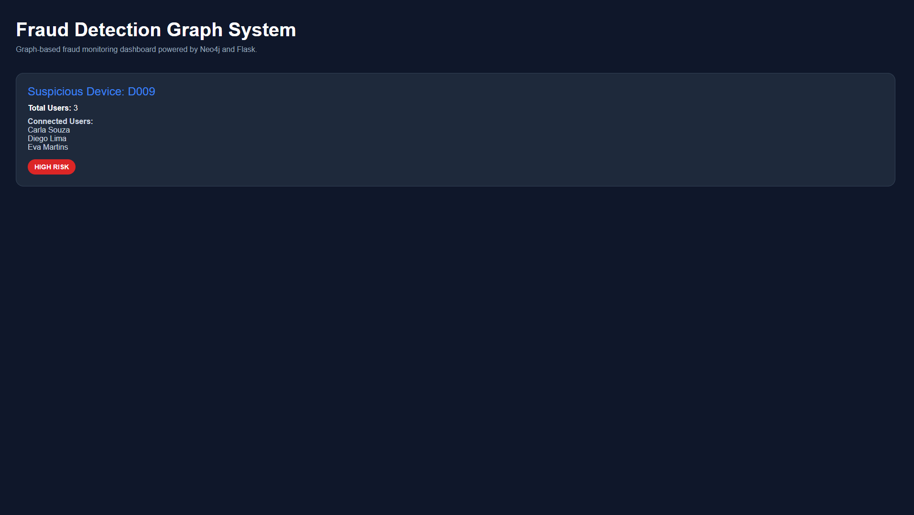
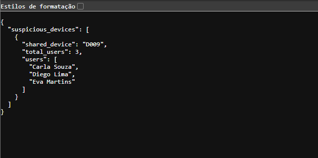

# Fraud Detection Graph System

---

# Fraud Detection Graph System

Graph-based fraud detection system using Neo4j, Python and Flask to identify suspicious transaction patterns through relationship analysis.

---

## Overview

This project explores how graph databases can be used to detect potential fraud by analyzing connections between users, cards, devices, IP addresses, merchants, and transactions.

The system models financial behavior as a graph, allowing suspicious patterns to be detected through relationship traversal and graph-based risk analysis.

---

## Dashboard Preview

  

---

## Fraud Detection API Example

  

---

## Core Idea

Fraud is often not visible in isolated transactions.

However, suspicious behavior can appear when analyzing relationships such as:

- Multiple users sharing the same device
- Several cards linked to the same IP address
- Users connected to suspicious merchants
- Transactions occurring through unusual connection patterns
- Dense networks of related accounts and payment methods

This project uses Neo4j to represent these connections and identify potential fraud risks.

---

## Features Implemented

- Transaction relationship modeling with Neo4j
- Shared device fraud detection
- Flask API integration
- Interactive fraud monitoring dashboard
- Graph-based suspicious activity analysis

---

## Architecture

The system is structured into three main layers:

- Flask API for backend services
- Neo4j graph database for relationship analysis
- Dashboard frontend for fraud monitoring visualization

Transactions are transformed into graph relationships, enabling complex fraud pattern detection through Cypher queries.

---

## Planned Features

- Graph-based fraud relationship modeling
- Suspicious transaction detection
- Risk scoring system
- Cypher queries for fraud pattern analysis
- Flask backend API
- Simple dashboard for visualizing suspicious activity
- Neo4j graph visualization

---

## Technologies

- Python
- Flask
- Neo4j
- Cypher
- HTML
- CSS
- JavaScript

---

## API Endpoints

| Endpoint | Description |
|---|---|
| `/load-data` | Loads transaction data into Neo4j |
| `/suspicious-devices` | Detects shared suspicious devices |
| `/dashboard` | Fraud monitoring dashboard |

---

## Future Improvements

- Fraud risk scoring engine
- Real-time transaction monitoring
- Advanced graph analytics
- Interactive Neo4j visualization
- Authentication system
- Docker deployment
- Cloud infrastructure integration

---

## Project Status

Active development with core fraud detection features already implemented.

---

## Author

Maria Eduarda Toso
